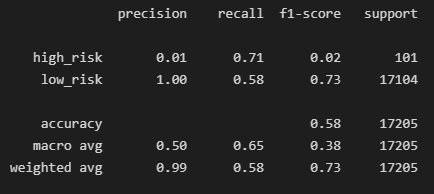
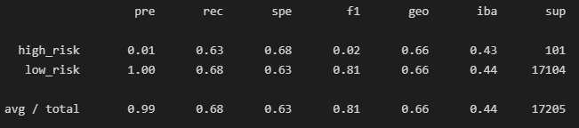
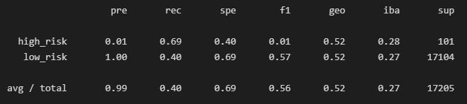
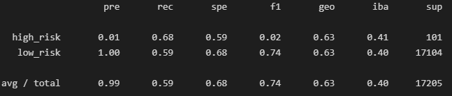
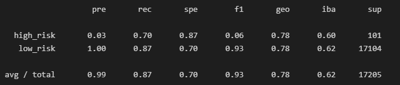
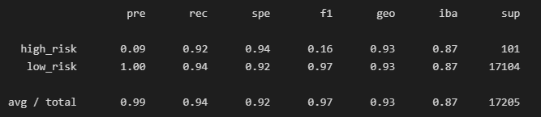

# Credit Risk Analysis

**File Sources:** [Credit Risk Resampling]("credit_risk_resampling.ipynb"), [Credit Risk Ensemble]("credit_risk_ensemble.ipynb")
**Data:** [Loan Stats 2019 Q1]("Resources/LoanStats_2019Q1.csv")

---

## Overview of Loan Prediction Risk Analysis:

The purpose of this analysis is to use machine learning as a way to solve credit card risk. Credit risk is inherently unbalanced classification problem, as good loans easily outnumber risky loans. Train and evaluate the models. Then resample the data using different techniques from the **imbalanced-learn** and **scikit-learn** libraries.

Using the credit card dataset from LendingClub, a peer to peer lending services company, oversample the data using **RandomOverSampler** and **SMOTE** algorithms. Undersample the data using **ClusterCentroids** algorithm. Then use the **SMOTEENN** algorithm to over- and undersample the data. Finally, use **BalancedRandomForestClassifier** and **EasyEnsembleClassifier** to compare the two machine learning models that reduce bias to predict credit risk.

---

## Results:

**Balanced Accuracy Scores from Credit Risk Resampling**

- Niave Random Sampling using RandomOverSampler - **Balanced Accuracy Score: 0.65**
  

- Oversampling usiung SMOTE - **Balanced Accuracy Score: 0.66**
  

- Undersampling using ClusterCentroids - **Balanced Accuracy Score: 0.54**
  

- Combination Over- and Undersampling using SMOTEENN - **Balanced Accuracy Score: 0.64**
  

**Credit Risk Ensemble**

- Balanced Random Forest Classifier - **Balanced Accuracy Score: 0.79**
  
- Easy Ensemble Adaboost Classifier - **Balanced Accuracy Score: 0.93**
  

---

## Summary:

Based on the above analysis, the best technique to use to asses the credit risk would be to use the Easy Ensemble Adaboost Classifier method. It yeilded the best balanced accuracy score of 0.93. The rest of the techniques prove to show very low accuracy when determining credit risk.
